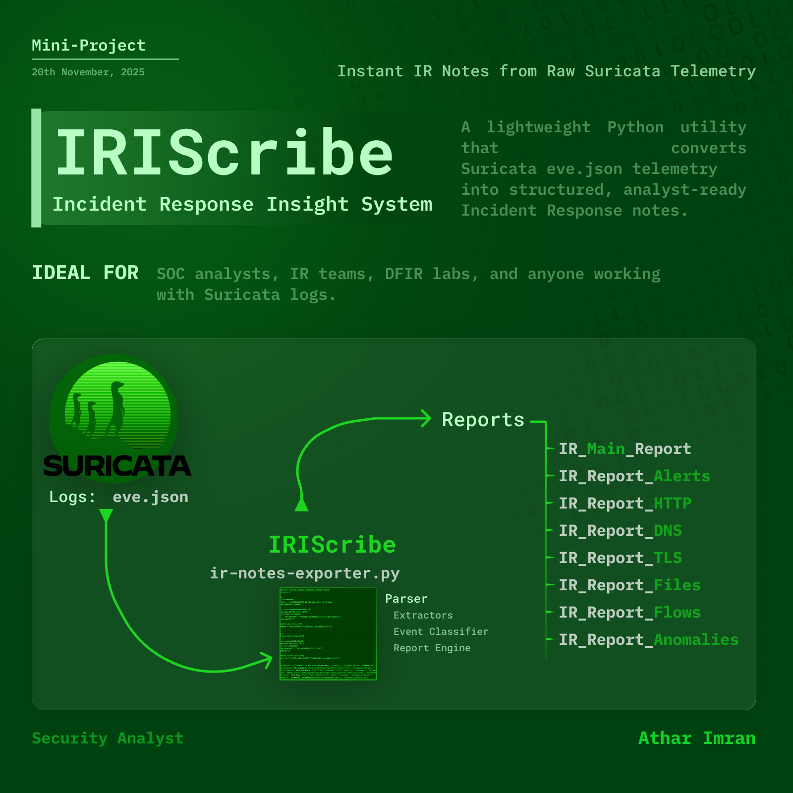

# IRIScribe - Incident Response Insight System



A lightweight Python utility that converts Suricata `eve.json` telemetry into structured, analyst-ready Incident Response notes.  
Instead of manually digging through thousands of events, this script automatically produces a complete Markdown report set:
- Main IR Summary  
- Alerts Breakdown  
- DNS Activity  
- TLS Sessions  
- HTTP Logs  
- Flow Records  
- File Transfers  
- Anomalies  

Ideal for SOC analysts, IR teams, DFIR labs, and anyone working with Suricata logs.

---

## Features

- Parses Suricata `eve.json` line-by-line (handles bad/partial JSON safely)
- Generates a **Main IR Report** with:
  - Time range
  - Event distribution
  - Key observations
  - Recommended actions
- Exports **detailed Markdown reports** for each category
- Extracts:
  - Alerts (signature, severity, category, IPs)
  - DNS queries & answers
  - TLS metadata (SNI, subject, issuer, JA3)
  - HTTP requests
  - Network flows
  - File transfers
  - Anomalies
- No external dependencies except Python standard library

---

## Output Structure

Running the script produces files like:

```
IR_Main_Report.md
IR_Report_Alerts.md
IR_Report_DNS.md
IR_Report_TLS.md
IR_Report_HTTP.md
IR_Report_Files.md
IR_Report_Flows.md
IR_Report_Anomalies.md
```


Each file is cleanly formatted in Markdown for direct use in IR tickets, cases, or documentation.

---

## Requirements

- Python 3.8+
- A valid `eve.json` file from Suricata (NDJSON format). Or use this: https://github.com/josevnz/SuricataLog/blob/main/test/eve.json

No third-party packages required.

---

## Usage

1. Place your Suricata `eve.json` in the same directory as the script.

2. Run:

```bash
python3 ir-notes-exporter.py
```

3. Your Markdown reports will be generated in the current folder.

## How It Works (Internal Logic)

Reads eve.json line-by-line
- Categorizes records by event_type
- Extracts timestamp range
- Builds counters + structured lists for:
- DNS queries/answers
  - TLS sessions
  - Alerts
  - HTTP logs
  - File transfers
  - Flows
  - Anomalies
- Generates a high-level IR summary
- Writes category-specific markdown files

## Example (From Real Data)

Event Breakdown Sample:

`dns (2561), tls (670), fileinfo (54), flow (2996), alert (275), anomaly (183)`

Time Range:

`2019-09-25T17:53:24 → 2022-04-17T12:21:05`

This makes it extremely fast to understand long-running captures or IR case logs.

##

Pull requests welcome - improvements to parsing, enrichment, or formatting are appreciated
